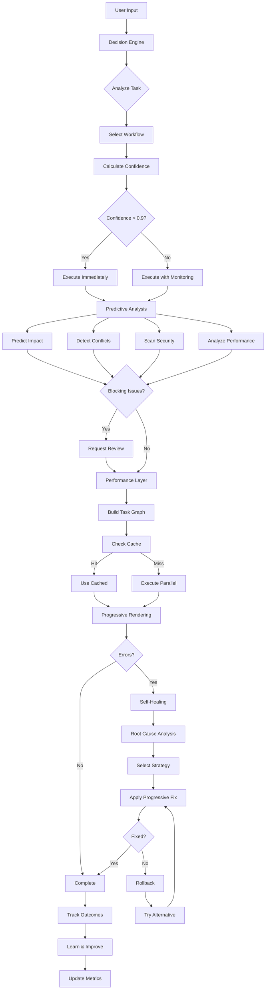
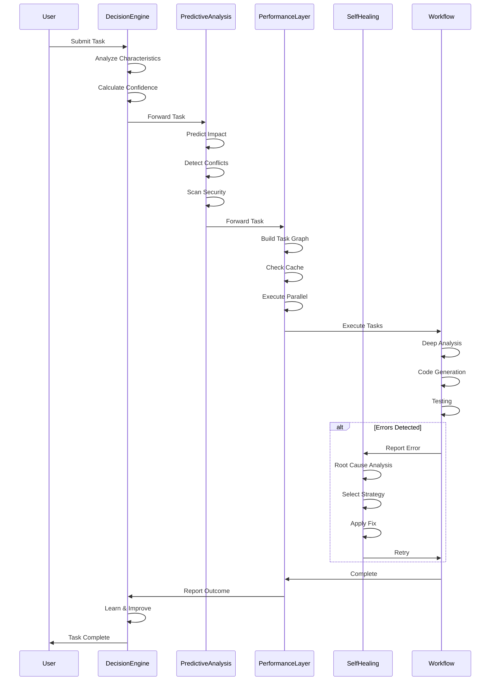
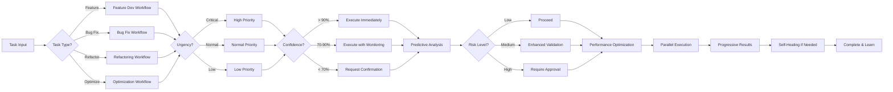
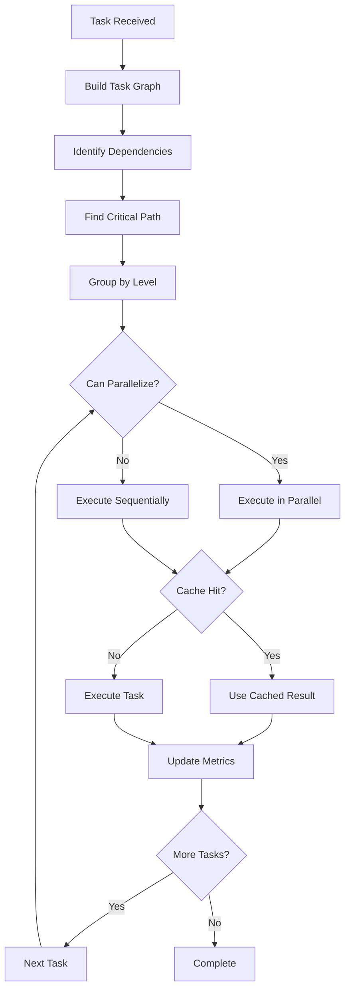
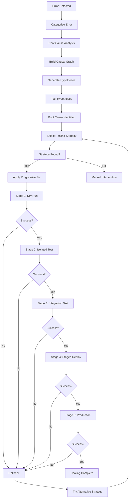
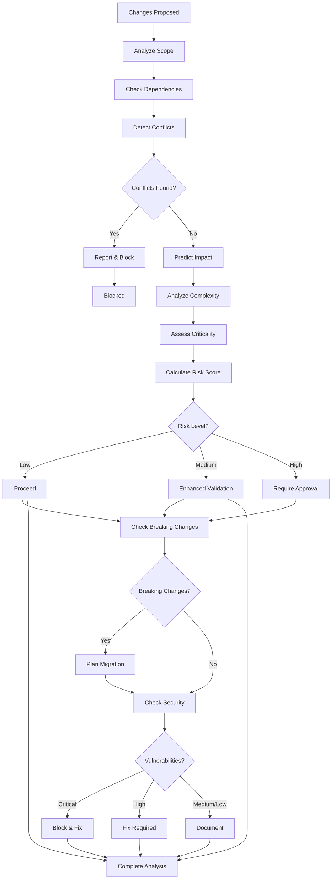
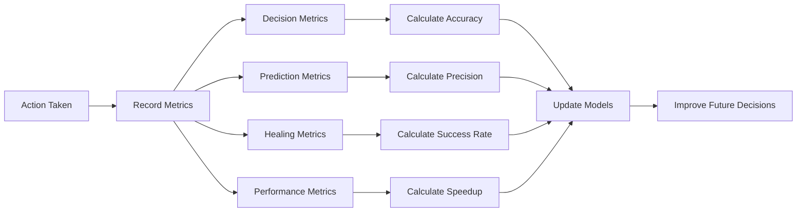
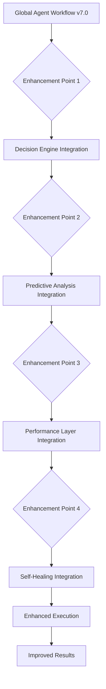

# 🏗️ Harbor AI Agent v8.0 - Architecture Diagram

**Version:** 8.0.0
**Last Updated:** 2026-03-19

---

# 🎯 SYSTEM ARCHITECTURE OVERVIEW

```
┌─────────────────────────────────────────────────────────────────────────────┐
│                          HARBOR AI AGENT v8.0                               │
│                    Autonomous Engineering Platform                          │
└─────────────────────────────────────────────────────────────────────────────┘

                                ↓ USER INPUT ↓

┌─────────────────────────────────────────────────────────────────────────────┐
│                           🧠 DECISION ENGINE                                │
│  ┌─────────────────┐  ┌─────────────────┐  ┌─────────────────┐            │
│  │  Decision Matrix│  │ Confidence Score│  │ Context Router  │            │
│  └─────────────────┘  └─────────────────┘  └─────────────────┘            │
│                                   ↓                                         │
│                    Select Optimal Workflow & Strategy                       │
└─────────────────────────────────────────────────────────────────────────────┘
                                   ↓
┌─────────────────────────────────────────────────────────────────────────────┐
│                          🔮 PREDICTIVE ANALYSIS                             │
│  ┌────────────────┐  ┌────────────────┐  ┌────────────────┐               │
│  │ Impact Predictor│  │ Conflict Detect│  │ Security Scan  │               │
│  └────────────────┘  └────────────────┘  └────────────────┘               │
│  ┌────────────────┐  ┌────────────────┐                                  │
│  │ Breaking Change│  │ Performance    │                                  │
│  │    Detector    │  │   Analyzer     │                                  │
│  └────────────────┘  └────────────────┘                                  │
│                                   ↓                                         │
│                      Predict & Prevent Issues                              │
└─────────────────────────────────────────────────────────────────────────────┘
                                   ↓
┌─────────────────────────────────────────────────────────────────────────────┐
│                         ⚡ PERFORMANCE LAYER                                │
│  ┌─────────────────┐  ┌─────────────────┐  ┌─────────────────┐            │
│  │  Task Graph     │  │  Smart Cache    │  │  Incremental    │            │
│  │  Executor       │  │  (3-Tier)       │  │  Processor      │            │
│  └─────────────────┘  └─────────────────┘  └─────────────────┘            │
│  ┌─────────────────┐  ┌─────────────────┐                                  │
│  │  Resource       │  │  Progressive    │                                  │
│  │  Optimizer      │  │  Renderer       │                                  │
│  └─────────────────┘  └─────────────────┘                                  │
│                                   ↓                                         │
│                      Execute Optimally & Efficiently                        │
└─────────────────────────────────────────────────────────────────────────────┘
                                   ↓
┌─────────────────────────────────────────────────────────────────────────────┐
│                        🛡️ SELF-HEALING SYSTEM v2.0                          │
│  ┌─────────────────┐  ┌─────────────────┐  ┌─────────────────┐            │
│  │  Root Cause     │  │  Healing        │  │  Progressive    │            │
│  │  Analyzer       │  │  Strategies     │  │  Fix Applicator │            │
│  └─────────────────┘  └─────────────────┘  └─────────────────┘            │
│  ┌─────────────────┐  ┌─────────────────┐                                  │
│  │  Automatic      │  │  Effectiveness  │                                  │
│  │  Rollback       │  │  Tracker        │                                  │
│  └─────────────────┘  └─────────────────┘                                  │
│                                   ↓                                         │
│                      Detect, Analyze, Heal, Learn                          │
└─────────────────────────────────────────────────────────────────────────────┘
                                   ↓
┌─────────────────────────────────────────────────────────────────────────────┐
│                      EXISTING WORKFLOW LAYER (v7.0)                         │
│  • Deep Repository Analysis       • Cross-Repo Dependency Mapping          │
│  • Feature Impact Analysis        • Pattern Consistency Verification       │
│  • Repository Rule Detection      • Testing & Self-Validation              │
└─────────────────────────────────────────────────────────────────────────────┘
                                   ↓
┌─────────────────────────────────────────────────────────────────────────────┐
│                      EXECUTION & VALIDATION LAYER                           │
│  • Code Generation                • Build & Deploy                          │
│  • Testing                        • PR Creation                             │
│  • Ticket Closure                 • Documentation                          │
└─────────────────────────────────────────────────────────────────────────────┘
                                   ↓
                              ✅ COMPLETED ✅
```

---

# 🔄 DETAILED WORKFLOW



---

# 📊 DATA FLOW DIAGRAM



---

# 🏗️ COMPONENT HIERARCHY

```
Harbor AI Agent v8.0
│
├── 🧠 Intelligence Layer (NEW)
│   ├── Decision Engine
│   │   ├── Decision Matrix System
│   │   ├── Confidence Scoring
│   │   ├── Context-Aware Routing
│   │   ├── Multi-Objective Optimization
│   │   └── Learning from Outcomes
│   │
│   ├── Predictive Analysis
│   │   ├── Impact Prediction Engine
│   │   ├── Dependency Conflict Detection
│   │   ├── Performance Impact Analysis
│   │   ├── Breaking Change Detection
│   │   └── Security Vulnerability Scanning
│   │
│   ├── Self-Healing System v2.0
│   │   ├── Healing Strategy Database
│   │   ├── Root Cause Analysis Engine
│   │   ├── Progressive Fix Application
│   │   ├── Rollback Automation
│   │   └── Healing Effectiveness Tracking
│   │
│   └── Performance Layer
│       ├── Intelligent Task Graph
│       ├── Smart Caching Layer
│       ├── Incremental Processing
│       ├── Resource Optimization
│       └── Progressive Rendering
│
├── 🔄 Workflow Layer (EXISTING v7.0)
│   ├── Global Agent Workflow
│   ├── Deep Repository Analysis
│   ├── Cross-Repository Dependency Mapping
│   ├── Feature Impact Analysis
│   ├── Pattern Consistency Verification
│   ├── Repository Rule Detection
│   └── Testing & Self-Validation
│
└── ⚙️ Execution Layer (EXISTING v7.0)
    ├── Code Generation
    ├── Build & Deploy
    ├── Testing
    ├── PR Creation
    └── Ticket Closure
```

---

# 🎯 DECISION FLOW



---

# 📈 PERFORMANCE OPTIMIZATION FLOW



---

# 🛡️ SELF-HEALING FLOW



---

# 🔮 PREDICTIVE ANALYSIS FLOW



---

# 📊 METRICS COLLECTION FLOW



---

# 🎯 INTEGRATION POINTS



---

## 📊 COMPONENT INTERFACES

### Decision Engine API

```yaml
input:
  task: string
  context: object

output:
  workflow: string
  confidence: float
  config: object
  reasoning: object
```

### Predictive Analysis API

```yaml
input:
  changes: array
  context: object

output:
  impact: object
  conflicts: array
  breaking_changes: array
  vulnerabilities: array
  risk_score: float
```

### Self-Healing API

```yaml
input:
  error: object
  context: object

output:
  strategy: object
  root_cause: object
  fix_applied: boolean
  success: boolean
  attempts: integer
```

### Performance Layer API

```yaml
input:
  tasks: array
  context: object

output:
  results: object
  execution_time: float
  cache_hit_rate: float
  parallel_efficiency: float
```

---

## 🎯 ARCHITECTURAL PRINCIPLES

1. **Separation of Concerns**
   - Each component has a clear responsibility
   - Minimal coupling between components
   - Well-defined interfaces

2. **Layered Architecture**
   - Intelligence layer on top
   - Workflow layer in middle
   - Execution layer at bottom

3. **Data Flow**
   - Unidirectional flow where possible
   - Clear input/output contracts
   - Feedback loops for learning

4. **Scalability**
   - Horizontal scaling possible
   - Caching at multiple levels
   - Incremental processing

5. **Resilience**
   - Self-healing capabilities
   - Rollback mechanisms
   - Graceful degradation

---

## 🚀 DEPLOYMENT ARCHITECTURE

```
Development Environment:
┌─────────────────────────────────────┐
│  Local Development                  │
│  - All components active            │
│  - Verbose logging                  │
│  - Debug mode                       │
└─────────────────────────────────────┘

Staging Environment:
┌─────────────────────────────────────┐
│  Staging / Testing                  │
│  - All components active            │
│  - Production-like config           │
│  - Monitoring enabled               │
└─────────────────────────────────────┘

Production Environment:
┌─────────────────────────────────────┐
│  Production                         │
│  - Optimized configuration          │
│  - Reduced logging                  │
│  - Performance monitoring           │
│  - Error tracking                   │
└─────────────────────────────────────┘
```

---

**Document Version:** 1.0.0
**Last Updated:** 2026-03-19
**Status:** FINAL

---

*This architecture diagram provides a visual representation of the Harbor AI Agent v8.0 system architecture and data flows.*
