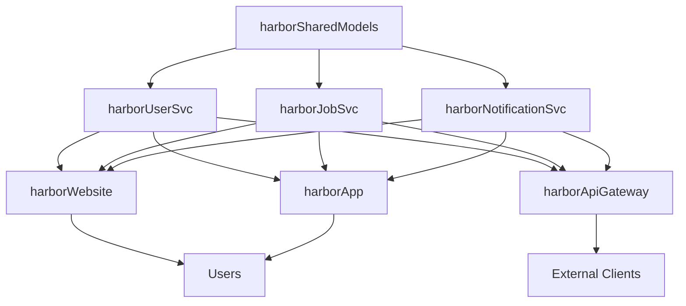

# Deep Repository Analysis System

**Version:** 1.0.0
**Last Updated:** 2026-03-18
**Purpose:** Perform comprehensive, multi-stage repository analysis to fully understand system structure before implementation

---

## 🎯 Core Philosophy

**An experienced engineer studies a system before changing it.**

The agent must perform **deep repository analysis** that goes beyond surface-level scanning. This analysis must understand:

1. **Repository Purpose & Role** - What this repository does in the system
2. **Internal Architecture** - How code is organized internally
3. **Integration Patterns** - How this repository connects to others
4. **Implementation Conventions** - How features are typically implemented
5. **Implicit Rules** - Undocumented patterns that must be followed
6. **Dependencies & Dependencies** - What depends on this, and what this depends on

---

## Phase 1: Repository Discovery

### 1.1 Workspace Scanning

**Action:** Comprehensive scan of the entire workspace

```bash
# Workspace root
WORKSPACE_ROOT=/Users/mohitshah/Documents/HarborService/

# Deep scan all directories
find ${WORKSPACE_ROOT} -maxdepth 2 -type d -name ".git" | sed 's|/.git||'
```

**Output:** Complete list of all git repositories in workspace

### 1.2 Repository Classification

**For EACH repository discovered, classify its type:**

#### Classification Algorithm

```javascript
function classifyRepository(repositoryPath) {
  const analysis = {
    // Read core configuration
    packageJson: readPackageJson(repositoryPath),
    tsconfig: readTsConfig(repositoryPath),
    readme: readReadme(repositoryPath),
    dockerfile: readDockerfile(repositoryPath),

    // Analyze directory structure
    directories: scanDirectoryStructure(repositoryPath),

    // Detect entry points
    entryPoints: detectEntryPoints(repositoryPath),

    // Analyze dependencies
    dependencies: analyzeDependencies(repositoryPath),

    // Scan for specific indicators
    indicators: scanIndicators(repositoryPath)
  };

  // Classify based on ALL evidence
  return classifyBasedOnEvidence(analysis);
}
```

#### Repository Types

| Type | Indicators | Purpose |
|------|------------|---------|
| **Backend Service** | Express/Fastify/Nest.js, routes/, controllers/, server.js | API endpoints, business logic |
| **Frontend Web** | Next.js/React, app/, pages/, components/ | Web UI, browser-based |
| **Mobile App** | React Native, ios/, android/, App.tsx | iOS/Android application |
| **Shared Library** | index.ts exports, no server entry, multiple consumers | Code consumed by others |
| **Gateway/Proxy** | nginx, Kong, API Gateway patterns | Request routing, auth |
| **Worker Service** | Bull/BullMQ, jobs/, tasks/, no HTTP | Background processing |
| **Database Service** | migrations/, Sequelize/Prisma, no API | Data layer management |
| **Notification Service** | SendGrid/Twilio, email/, sms/ | Messaging/notifications |
| **Real-time Service** | WebSocket, Socket.io, ws/ | Live updates |
| **Infrastructure** | Terraform/K8s/Docker Compose, no app code | DevOps/CI/CD |

### 1.3 Repository Purpose Inference

**Deep analysis to understand WHY this repository exists:**

```javascript
function inferRepositoryPurpose(repository) {
  const evidence = {
    // Configuration evidence
    name: repository.packageJson.name,
    description: repository.packageJson.description,
    keywords: repository.packageJson.keywords,

    // Structural evidence
    mainDirectories: Object.keys(repository.directories),
    hasApiLayer: repository.directories.routes || repository.directories.controllers,
    hasServiceLayer: repository.directories.services,
    hasDataLayer: repository.directories.models || repository.directories.repositories,
    hasUiLayer: repository.directories.components || repository.directories.pages,

    // Dependency evidence
    apiFramework: detectApiFramework(repository.dependencies),
    uiFramework: detectUiFramework(repository.dependencies),
    database: detectDatabase(repository.dependencies),

    // Entry point evidence
    mainEntry: repository.entryPoints.main,
    serverEntry: repository.entryPoints.server,
    workerEntry: repository.entryPoints.worker,

    // Code evidence
    exportsExports: scanExports(repository),
    importsImports: scanImports(repository),
    apiEndpoints: scanApiEndpoints(repository)
  };

  return synthesizePurpose(evidence);
}
```

**Output:**

```javascript
{
  repository: "harborUserSvc",
  type: "Backend Service",
  purpose: "User management API service",
  responsibilities: [
    "User authentication",
    "User profile management",
    "User preferences",
    "User availability"
  ],
  apis: [
    "POST /api/users",
    "GET /api/users/:id",
    "PUT /api/users/:id",
    "DELETE /api/users/:id"
  ],
  dependencies: ["harborSharedModels"],
  consumers: ["harborWebsite", "harborApp"]
}
```

---

## Phase 2: Structural Pattern Detection

### 2.1 Directory Structure Analysis

**Deep scan to understand how code is organized:**

```javascript
function analyzeDirectoryStructure(repository) {
  const structure = {
    // Full directory tree
    tree: buildDirectoryTree(repository.path),

    // Identify key directories
    keyDirectories: identifyKeyDirectories(repository.path),

    // Detect architectural pattern
    architecture: detectArchitecturalPattern(repository.path),

    // Identify entry points
    entryPoints: findAllEntryPoints(repository.path),

    // Find configuration files
    configurations: findAllConfigurations(repository.path)
  };

  return structure;
}
```

#### Architectural Pattern Detection

| Pattern | Indicators | Structure |
|---------|------------|-----------|
| **Layered** | routes/, controllers/, services/, models/ | Separation of concerns |
| **MVC** | models/, views/, controllers/ | Model-View-Controller |
| **Modular** | modules/, features/, each with own structure | Feature-based modules |
| **Domain-Driven** | domains/, each domain is self-contained | DDD boundaries |
| **Microservice** | Single purpose, minimal internal structure | Focused service |
| **Monorepo** | packages/, each package is separate | Multiple projects |

### 2.2 Entry Point Analysis

**Find ALL entry points to understand how code is loaded:**

```javascript
function detectEntryPoints(repository) {
  const entryPoints = {
    // Main entry points
    main: findFile(['main.js', 'main.ts', 'index.js', 'index.ts']),
    server: findFile(['server.js', 'server.ts', 'app.js', 'app.ts']),
    worker: findFile(['worker.js', 'worker.ts', 'job.js']),

    // Next.js specific
    nextApp: checkDirectory('app'),
    nextPages: checkDirectory('pages'),

    // React Native specific
    appEntry: findFile(['App.tsx', 'App.js']),
    indexEntry: findFile(['index.tsx', 'index.js']),

    // API entry points
    apiRoutes: scanApiRoutes(),

    // Exported modules
    exports: scanExports()
  };

  return entryPoints;
}
```

### 2.3 Dependency Declaration Analysis

**Understand how dependencies are managed:**

```javascript
function analyzeDependencyDeclarations(repository) {
  const analysis = {
    // Package manager detection
    packageManager: detectPackageManager(),

    // Local dependencies
    localDependencies: extractLocalDependencies(),

    // External dependencies
    externalDependencies: extractExternalDependencies(),

    // Dev dependencies
    devDependencies: extractDevDependencies(),

    // Dependency versions
    versionStrategy: analyzeVersionStrategy(),

    // Workspace references
    workspaceRefs: detectWorkspaceReferences()
  };

  return analysis;
}
```

### 2.4 Import/Export Pattern Analysis

**Understand how modules are imported and exported:**

```javascript
function analyzeImportExportPatterns(repository) {
  const patterns = {
    // Export patterns
    barrelExports: findBarrelExports(),
    namedExports: findNamedExports(),
    defaultExports: findDefaultExports(),

    // Import patterns
    relativeImports: analyzeRelativeImports(),
    absoluteImports: analyzeAbsoluteImports(),
    aliasImports: analyzeAliasImports(),

    // Path mapping
    pathMappings: detectPathMappings(),

    // Module resolution
    moduleSystem: detectModuleSystem()
  };

  return patterns;
}
```

**Example Detection:**

```javascript
// Barrel export pattern detected
// harborSharedModels/src/index.ts
export * from './models/User';
export * from './models/Job';
export * from './models/Notification';

// Usage in harborUserSvc
import { User, Job } from '@harbor/shared-models';
```

### 2.5 Module Registration Pattern Detection

**Detect how new modules/features are registered:**

```javascript
function detectModuleRegistrationPatterns(repository) {
  const registration = {
    // API route registration
    routeRegistration: detectRouteRegistration(),

    // Controller registration
    controllerRegistration: detectControllerRegistration(),

    // Service registration
    serviceRegistration: detectServiceRegistration(),

    // Model registration
    modelRegistration: detectModelRegistration(),

    // Middleware registration
    middlewareRegistration: detectMiddlewareRegistration(),

    // Component registration
    componentRegistration: detectComponentRegistration()
  };

  return registration;
}
```

**Example Detection:**

```javascript
// Express route registration pattern
// harborUserSvc/src/routes/index.ts
import userRoutes from './user.routes';
import jobRoutes from './job.routes';

router.use('/users', userRoutes);
router.use('/jobs', jobRoutes);

// Pattern: New routes must be imported and registered in routes/index.ts
```

### 2.6 Shared Resource Pattern Detection

**Detect how shared resources are managed:**

```javascript
function detectSharedResourcePatterns(repository) {
  const resources = {
    // Shared models
    sharedModels: detectSharedModelUsage(),

    // Shared utilities
    sharedUtils: detectSharedUtilUsage(),

    // Shared types
    sharedTypes: detectSharedTypeUsage(),

    // Shared configurations
    sharedConfigs: detectSharedConfigUsage(),

    // Shared constants
    sharedConstants: detectSharedConstantUsage()
  };

  return resources;
}
```

---

## Phase 3: Cross-Repository Dependency Mapping

### 3.1 Build Dependency Graph

**Create a comprehensive dependency graph:**

```javascript
function buildDependencyGraph(workspace) {
  const graph = {
    nodes: [], // repositories
    edges: [], // dependencies

    // Analyze each repository
    repositories: workspace.repos.map(repo => ({
      name: repo.name,
      path: repo.path,
      type: repo.type,

      // What this repository depends on
      dependencies: analyzeDependencies(repo),

      // What depends on this repository
      dependents: findDependents(repo, workspace),

      // Shared resources used
      sharedResources: identifySharedResources(repo),

      // APIs exposed
      exposedApis: scanExposedApis(repo),

      // APIs consumed
      consumedApis: scanConsumedApis(repo)
    }))
  };

  return graph;
}
```

### 3.2 Dependency Type Classification

**Classify different types of dependencies:**

| Dependency Type | Description | Example |
|-----------------|-------------|---------|
| **Code Dependency** | Imports code from another repo | `import { User } from '@harbor/shared-models'` |
| **API Dependency** | Calls APIs from another service | `axios.get('http://user-svc/users')` |
| **Database Dependency** | Shares database or schema | Multiple services using same DB |
| **Config Dependency** | Shares configuration | Shared environment variables |
| **Type Dependency** | Uses TypeScript types | Import types from shared lib |
| **Resource Dependency** | Shared files/assets | Shared translations, images |

### 3.3 Dependency Propagation Analysis

**Understand how changes propagate:**

```javascript
function analyzeDependencyPropagation(graph) {
  const propagation = {
    // For each repository, determine what affects it
    affectedBy: (repo) => {
      const directDeps = graph.dependencies[repo];
      const transitiveDeps = findTransitiveDependencies(graph, repo);
      return [...directDeps, ...transitiveDeps];
    },

    // For each repository, determine what it affects
    affects: (repo) => {
      const directDependents = graph.dependents[repo];
      const transitiveDependents = findTransitiveDependents(graph, repo);
      return [...directDependents, ...transitiveDependents];
    },

    // Determine change impact
    impact: (changedRepo) => {
      return {
        direct: graph.dependents[changedRepo],
        transitive: findTransitiveDependents(graph, changedRepo),
        ripple: calculateRippleEffect(graph, changedRepo)
      };
    }
  };

  return propagation;
}
```

### 3.4 Service Dependency Graph

**Visual representation of service dependencies:**



**Algorithm for topological sort:**

```javascript
function getImplementationOrder(graph) {
  // Implement in dependency order
  // 1. Shared libraries first (nothing depends on them)
  // 2. Backend services (depend on shared libs)
  // 3. Frontend clients (depend on backend APIs)

  const sorted = topologicalSort(graph);
  return sorted;
}
```

---

## Phase 4: Feature Impact Analysis

### 4.1 Task-Aware Impact Detection

**Analyze task requirements and determine impact:**

```javascript
function analyzeFeatureImpact(task, dependencyGraph, repositoryAnalysis) {
  const impact = {
    // Parse task requirements
    requirements: parseTaskRequirements(task),

    // Identify affected domain
    domain: identifyDomain(task),

    // Determine data model impact
    modelImpact: analyzeModelImpact(task, repositoryAnalysis),

    // Determine API impact
    apiImpact: analyzeApiImpact(task, repositoryAnalysis),

    // Determine UI impact
    uiImpact: analyzeUiImpact(task, repositoryAnalysis),

    // Determine configuration impact
    configImpact: analyzeConfigImpact(task, repositoryAnalysis),

    // Calculate affected repositories
    affectedRepositories: determineAffectedRepositories(task, dependencyGraph)
  };

  return impact;
}
```

### 4.2 Domain Mapping

**Map task requirements to domains:**

```javascript
function identifyDomain(task) {
  const domainKeywords = {
    user: ['user', 'profile', 'account', 'authentication', 'login'],
    job: ['job', 'work', 'task', 'harbor job', 'service request'],
    notification: ['notification', 'message', 'alert', 'email', 'sms'],
    payment: ['payment', 'billing', 'invoice', 'transaction'],
    schedule: ['schedule', 'calendar', 'availability', 'booking'],
    review: ['review', 'rating', 'feedback', 'testimonial'],
    location: ['location', 'geolocation', 'map', 'address', 'coordinates']
  };

  return matchDomains(task, domainKeywords);
}
```

### 4.3 Repository Impact Scoring

**Score each repository by relevance to the task:**

```javascript
function scoreRepositoryImpact(repository, task, domain) {
  const score = {
    // Domain relevance
    domainMatch: repository.domain === domain ? 50 : 0,

    // API relevance
    apiMatch: repository.apis.some(api =>
      task.requiredApis.includes(api)
    ) ? 30 : 0,

    // Model relevance
    modelMatch: repository.models.some(model =>
      task.requiredModels.includes(model)
    ) ? 20 : 0,

    // Technology fit
    techFit: calculateTechFit(repository, task),

    // Consumer relevance
    consumerRelevance: calculateConsumerRelevance(repository, task)
  };

  return Object.values(score).reduce((a, b) => a + b, 0);
}
```

### 4.4 Affected Repository Determination

**Determine ALL repositories that must be modified:**

```javascript
function determineAffectedRepositories(task, dependencyGraph) {
  const affected = {
    // Primary repositories (directly implement the feature)
    primary: [],

    // Secondary repositories (consume the feature)
    secondary: [],

    // Tertiary repositories (may need updates)
    tertiary: []
  };

  // Score all repositories
  const scores = dependencyGraph.repositories.map(repo => ({
    repository: repo,
    score: scoreRepositoryImpact(repo, task)
  }));

  // Classify by score
  scores.forEach(({ repository, score }) => {
    if (score >= 70) affected.primary.push(repository);
    else if (score >= 40) affected.secondary.push(repository);
    else if (score >= 20) affected.tertiary.push(repository);
  });

  return affected;
}
```

---

## Phase 5: Repository Rule Detection

### 5.1 Implicit Pattern Discovery

**Detect patterns that aren't explicitly documented:**

```javascript
function detectImplicitRules(repository) {
  const rules = {
    // Version update rules
    versionUpdate: detectVersionUpdateRules(repository),

    // Model registration rules
    modelRegistration: detectModelRegistrationRules(repository),

    // API registration rules
    apiRegistration: detectApiRegistrationRules(repository),

    // Export/index file rules
    exportUpdate: detectExportUpdateRules(repository),

    // Dependency synchronization rules
    dependencySync: detectDependencySyncRules(repository),

    // Installation rules
    installation: detectInstallationRules(repository),

    // Build rules
    build: detectBuildRules(repository),

    // Testing rules
    testing: detectTestingRules(repository)
  };

  return rules;
}
```

### 5.2 Version Update Rule Detection

**Detect if version updates are required:**

```javascript
function detectVersionUpdateRules(repository) {
  const indicators = {
    // Has package.json with version
    hasVersion: checkPackageJsonVersion(repository),

    // Other repos reference specific version
    hasVersionReferences: checkVersionReferences(repository),

    // Has changelog
    hasChangelog: checkChangelog(repository),

    // Pattern of version updates
    hasVersionPattern: detectVersionUpdatePattern(repository)
  };

  const requiresVersionUpdate =
    indicators.hasVersion &&
    (indicators.hasVersionReferences || indicators.hasChangelog);

  return {
    requiresVersionUpdate,
    indicators,
    workflow: inferVersionWorkflow(indicators)
  };
}
```

### 5.3 Model Registration Rule Detection

**Detect how models are registered:**

```javascript
function detectModelRegistrationRules(repository) {
  const patterns = [
    // Check for index.ts that exports models
    {
      pattern: 'barrel-export',
      check: () => hasFile('src/models/index.ts'),
      workflow: 'Add export to src/models/index.ts'
    },

    // Check for ORM registration
    {
      pattern: 'orm-registration',
      check: () => hasFile('src/database/index.ts'),
      workflow: 'Register model in src/database/index.ts'
    },

    // Check for Sequelize.sync pattern
    {
      pattern: 'sequelize-sync',
      check: () => codeContains('sequelize.sync()'),
      workflow: 'Model will be auto-synced'
    }
  ];

  return patterns.filter(p => p.check());
}
```

### 5.4 Export/Index File Rule Detection

**Detect if index files must be updated:**

```javascript
function detectExportUpdateRules(repository) {
  const exports = [];

  // Scan for all index.ts files
  const indexFiles = findAll('**/index.ts', repository);

  indexFiles.forEach(file => {
    const content = readFile(file);

    // Detect export patterns
    const patterns = {
      barrelExport: /export \* from ['"](.+)['"]/g,
      namedExport: /export \{ .+ \} from ['"](.+)['"]/g,
      reExport: /export \{ .+ \} from ['"](.+)['"]/g
    };

    // Store pattern for this file
    exports.push({
      file,
      patterns: Object.keys(patterns).filter(key =>
        patterns[key].test(content)
      )
    });
  });

  return exports;
}
```

### 5.5 Dependency Synchronization Rule Detection

**Detect if dependencies must be synchronized:**

```javascript
function detectDependencySyncRules(repository) {
  const rules = {
    // Check if local dependencies require version updates
    localDependencyVersion: detectLocalDependencyVersioning(repository),

    // Check if install is required after dependency change
    requiresInstall: detectInstallRequirement(repository),

    // Check if build is required after dependency change
    requiresBuild: detectBuildRequirement(repository),

    // Check for workspace dependencies
    workspaceDependencies: detectWorkspaceDependencies(repository)
  };

  return rules;
}
```

### 5.6 Installation Rule Detection

**Detect installation requirements:**

```javascript
function detectInstallationRules(repository) {
  const packageManager = detectPackageManager(repository);

  const rules = {
    packageManager,

    // When to run install
    installTriggers: [
      'package.json dependencies changed',
      'new local dependency added',
      'dependency version updated',
      'node_modules not present'
    ],

    // Install command
    installCommand: getInstallCommand(packageManager),

    // Check if lock file exists
    hasLockFile: checkLockFile(repository, packageManager)
  };

  return rules;
}
```

---

## Phase 6: Integration Pattern Detection

### 6.1 API Integration Pattern Detection

**Detect how APIs are integrated:**

```javascript
function detectApiIntegrationPatterns(repository) {
  const patterns = {
    // Direct HTTP calls
    directHttp: detectDirectHttpCalls(repository),

    // API client library
    apiClient: detectApiClient(repository),

    // API service layer
    apiService: detectApiService(repository),

    // GraphQL
    graphql: detectGraphQL(repository),

    // WebSocket
    websocket: detectWebSocket(repository)
  };

  return patterns;
}
```

### 6.2 State Management Pattern Detection

**Detect state management approach:**

```javascript
function detectStateManagementPatterns(repository) {
  const patterns = {
    // React Context
    useContext: detectReactContext(repository),

    // Redux
    redux: detectRedux(repository),

    // MobX
    mobx: detectMobx(repository),

    // Zustand
    zustand: detectZustand(repository),

    // Recoil
    recoil: detectRecoil(repository),

    // Local state
    localState: detectLocalState(repository)
  };

  return Object.keys(patterns).find(key => patterns[key]);
}
```

### 6.3 Data Flow Pattern Detection

**Detect how data flows through the application:**

```javascript
function detectDataFlowPatterns(repository) {
  const patterns = {
    // Unidirectional (React/Redux)
    unidirectional: detectUnidirectionalFlow(repository),

    // Bidirectional (two-way binding)
    bidirectional: detectBidirectionalFlow(repository),

    // Event-based
    eventBased: detectEventBasedFlow(repository),

    // Stream-based
    streamBased: detectStreamBasedFlow(repository)
  };

  return patterns;
}
```

---

## Analysis Output Structure

### Complete Repository Analysis

```javascript
{
  // Repository identification
  repository: {
    name: "harborUserSvc",
    path: "/Users/mohitshah/Documents/HarborService/harborUserSvc",
    type: "Backend Service",
    purpose: "User management API service"
  },

  // Architecture
  architecture: {
    pattern: "Layered Architecture",
    layers: {
      routes: "src/routes/",
      controllers: "src/controllers/",
      services: "src/services/",
      models: "src/models/",
      repositories: "src/repositories/"
    }
  },

  // Dependencies
  dependencies: {
    code: ["harborSharedModels"],
    api: [],
    database: ["PostgreSQL"],
    external: ["express", "sequelize", "jsonwebtoken"]
  },

  // Dependents
  dependents: {
    code: [],
    api: ["harborWebsite", "harborApp"],
    database: []
  },

  // Integration patterns
  integration: {
    apiRegistration: "Register in src/routes/index.ts",
    modelRegistration: "Export from src/models/index.ts",
    dependencySync: "Update version in package.json + npm install",
    installCommand: "npm install",
    buildCommand: "npm run build"
  },

  // Implicit rules
  rules: {
    versionUpdate: true,
    exportUpdate: true,
    dependencySync: true,
    installation: true
  },

  // Conventions
  conventions: {
    codeStyle: "TypeScript with semicolons",
    importStyle: "Absolute imports with path aliases",
    errorHandling: "Try-catch with asyncErrorHandler",
    logging: "Winston logger",
    testing: "Jest with supertest"
  }
}
```

---

## Analysis Workflow Integration

### When to Run Deep Analysis

**Deep repository analysis MUST run:**

1. **On agent startup** - Build complete picture of workspace
2. **Before each task** - Re-analyze affected repositories
3. **After major changes** - Update analysis if structure changed
4. **When uncertain** - Re-analyze if implementation doesn't match expectations

### Analysis Caching

**Cache analysis results to avoid redundant work:**

```javascript
const analysisCache = {
  // Cache key: repository path + last commit hash
  get: (repository) => cache.get(cacheKey(repository)),
  set: (repository, analysis) => cache.set(cacheKey(repository), analysis),
  isValid: (repository) => {
    const cached = cache.get(cacheKey(repository));
    return cached && cached.lastCommit === getCurrentCommit(repository);
  }
};
```

---

## 🚨 CRITICAL: Analysis Must Complete Before Implementation

**ABSOLUTE RULE:**

```
DO NOT begin implementation until deep repository analysis is complete.

Implementation WITHOUT complete analysis = Partial integration

Partial integration = FAILED feature
```

**Analysis Checklist:**

- [ ] All repositories discovered and classified
- [ ] Repository purposes inferred and verified
- [ ] Structural patterns detected
- [ ] Dependency graph built
- [ ] Integration patterns detected
- [ ] Implicit rules discovered
- [ ] Feature impact analyzed
- [ ] Affected repositories determined
- [ ] Implementation order calculated

**Only when ALL checks pass → Continue to implementation**

---

**End of Deep Repository Analysis System**
